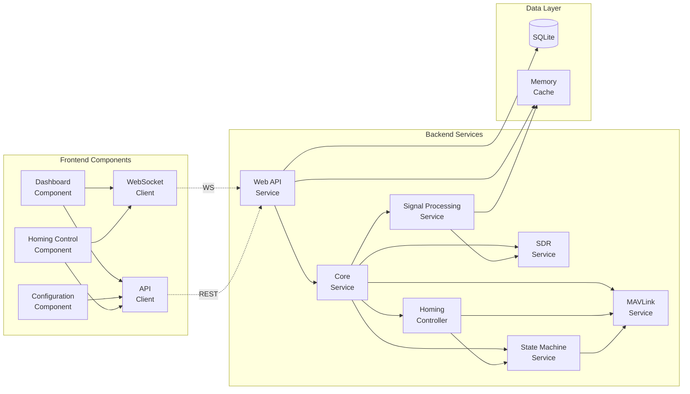

# Components

## Core Service
**Responsibility:** Main application orchestrator managing lifecycle of all services and handling graceful shutdown

**Key Interfaces:**
- Service registration and dependency injection
- Graceful shutdown coordination
- Configuration loading and validation
- Health check aggregation

**Dependencies:** All other services

**Technology Stack:** Python AsyncIO with dependency injection pattern

## SDR Service
**Responsibility:** Hardware abstraction layer for SDR devices, managing device lifecycle and IQ sample streaming

**Key Interfaces:**
- `initialize(config: SDRConfig)` - Device initialization
- `stream_iq() -> AsyncGenerator` - IQ sample streaming
- `set_frequency(freq: float)` - Frequency tuning
- `get_status() -> SDRStatus` - Health monitoring

**Dependencies:** SoapySDR, hardware drivers

**Technology Stack:** Python SoapySDR bindings with async wrapper

## Signal Processing Service
**Responsibility:** Real-time RSSI computation, noise floor estimation, and signal detection logic

**Key Interfaces:**
- `process_iq(samples: np.array) -> RSSIReading` - RSSI calculation
- `update_noise_floor(readings: List[float])` - Noise estimation
- `detect_signal(rssi: float) -> DetectionEvent` - Detection logic
- `compute_gradient(history: List[RSSIReading]) -> Vector` - Gradient for homing

**Dependencies:** NumPy, SciPy, SDR Service

**Technology Stack:** NumPy/SciPy with optimized FFT operations

## MAVLink Service
**Responsibility:** Bidirectional communication with flight controller, command sending, and telemetry reception

**Key Interfaces:**
- `connect(port: str, baud: int)` - Serial connection
- `send_velocity_command(vx: float, yaw_rate: float)` - Movement commands
- `get_telemetry() -> FlightTelemetry` - Current telemetry
- `subscribe_mode_changes() -> AsyncIterator` - Mode monitoring

**Dependencies:** pymavlink, serial interface

**Technology Stack:** pymavlink with AsyncIO serial wrapper

## State Machine Service
**Responsibility:** Manages operational states (IDLE, SEARCHING, HOMING) with safety-enforced transitions

**Key Interfaces:**
- `transition_to(state: State) -> bool` - Request state change
- `get_current_state() -> State` - Current state query
- `register_guard(guard: SafetyGuard)` - Add safety check
- `get_allowed_transitions() -> List[State]` - Valid transitions

**Dependencies:** MAVLink Service, Signal Processing Service

**Technology Stack:** Python state machine with async guards

## Homing Controller
**Responsibility:** Implements gradient climbing algorithm and generates velocity commands for beacon approach

**Key Interfaces:**
- `enable_homing(confirmation: str) -> bool` - Activate homing
- `compute_velocity(gradient: Vector) -> VelocityCommand` - Gradient to velocity
- `execute_sampling_maneuver()` - S-turn for gradient sampling
- `disable_homing(reason: str)` - Deactivate homing

**Dependencies:** State Machine Service, MAVLink Service

**Technology Stack:** Python control algorithms with NumPy

## Web API Service
**Responsibility:** FastAPI server providing REST endpoints and WebSocket connections for frontend

**Key Interfaces:**
- REST endpoints as defined in API specification
- WebSocket connection management
- Static file serving for React app
- CORS and security middleware

**Dependencies:** All backend services

**Technology Stack:** FastAPI with Uvicorn ASGI server

## Frontend Dashboard Component
**Responsibility:** Main operational view with real-time RSSI display and system status

**Key Interfaces:**
- WebSocket subscription for real-time updates
- Homing activation control
- Safety status display
- Detection event log

**Dependencies:** WebSocket Service, API Client

**Technology Stack:** React with MUI components, recharts for graphs

## Frontend Configuration Component
**Responsibility:** SDR and profile configuration management interface

**Key Interfaces:**
- Profile CRUD operations
- Real-time parameter adjustment
- Profile activation
- Settings validation

**Dependencies:** REST API Client

**Technology Stack:** React with MUI form components

## Component Diagrams

