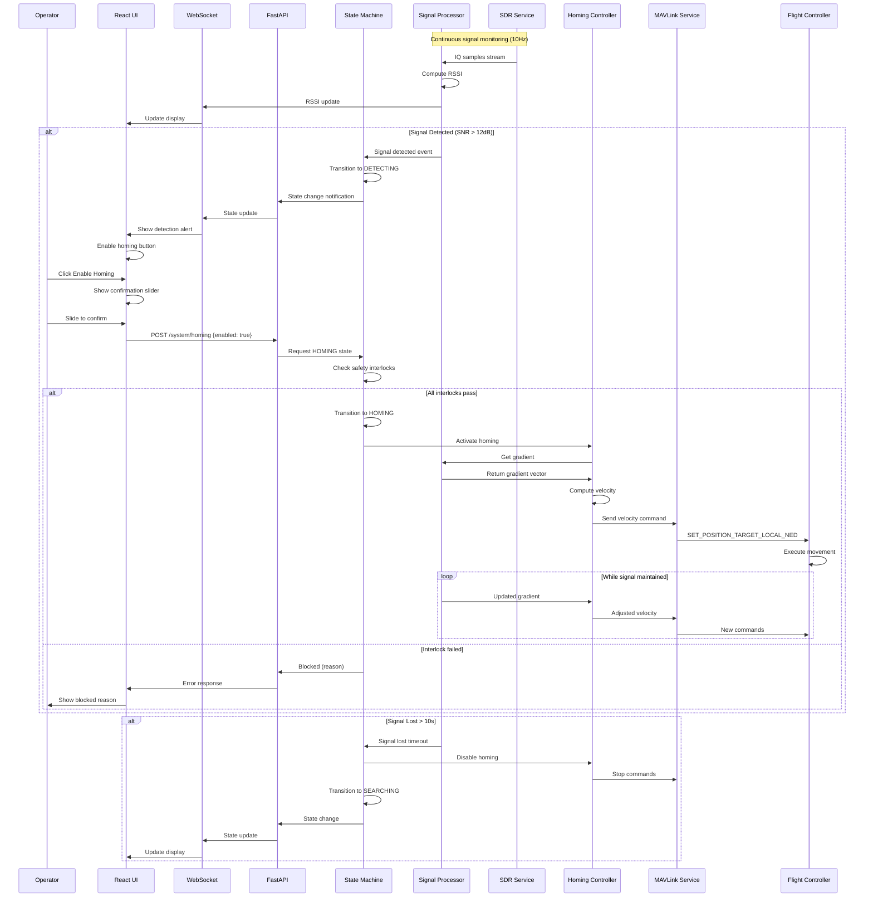
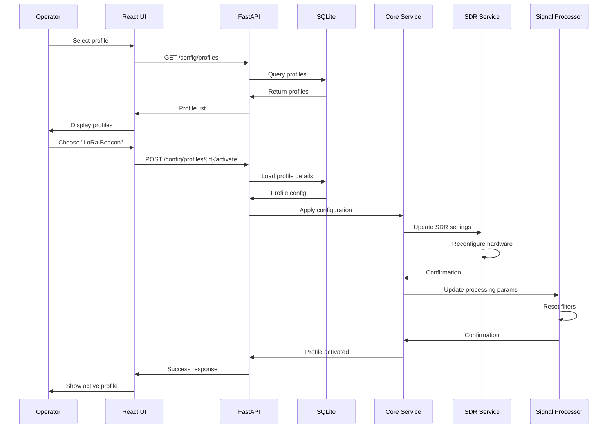

# Core Workflows

## Signal Detection and Homing Activation Workflow

```mermaid
sequenceDiagram
    participant Op as Operator
    participant UI as React UI
    participant WS as WebSocket
    participant API as FastAPI
    participant SM as State Machine
    participant SP as Signal Processor
    participant SDR as SDR Service
    participant HC as Homing Controller
    participant MAV as MAVLink Service
    participant FC as Flight Controller

    Note over SDR,SP: Continuous signal monitoring (10Hz)
    SDR->>SP: IQ samples stream
    SP->>SP: Compute RSSI
    SP->>WS: RSSI update
    WS->>UI: Update display

    alt Signal Detected (SNR > 12dB)
        SP->>SM: Signal detected event
        SM->>SM: Transition to DETECTING
        SM->>API: State change notification
        API->>WS: State update
        WS->>UI: Show detection alert
        UI->>UI: Enable homing button

        Op->>UI: Click Enable Homing
        UI->>UI: Show confirmation slider
        Op->>UI: Slide to confirm
        UI->>API: POST /system/homing {enabled: true}

        API->>SM: Request HOMING state
        SM->>SM: Check safety interlocks
        alt All interlocks pass
            SM->>SM: Transition to HOMING
            SM->>HC: Activate homing
            HC->>SP: Get gradient
            SP->>HC: Return gradient vector
            HC->>HC: Compute velocity
            HC->>MAV: Send velocity command
            MAV->>FC: SET_POSITION_TARGET_LOCAL_NED
            FC->>FC: Execute movement

            loop While signal maintained
                SP->>HC: Updated gradient
                HC->>MAV: Adjusted velocity
                MAV->>FC: New commands
            end
        else Interlock failed
            SM->>API: Blocked (reason)
            API->>UI: Error response
            UI->>Op: Show blocked reason
        end
    end

    alt Signal Lost > 10s
        SP->>SM: Signal lost timeout
        SM->>HC: Disable homing
        HC->>MAV: Stop commands
        SM->>SM: Transition to SEARCHING
        SM->>API: State change
        API->>WS: State update
        WS->>UI: Update display
    end
```

## Configuration Profile Loading Workflow

```mermaid
sequenceDiagram
    participant Op as Operator
    participant UI as React UI
    participant API as FastAPI
    participant DB as SQLite
    participant Core as Core Service
    participant SDR as SDR Service
    participant SP as Signal Processor

    Op->>UI: Select profile
    UI->>API: GET /config/profiles
    API->>DB: Query profiles
    DB->>API: Return profiles
    API->>UI: Profile list
    UI->>Op: Display profiles

    Op->>UI: Choose "LoRa Beacon"
    UI->>API: POST /config/profiles/{id}/activate
    API->>DB: Load profile details
    DB->>API: Profile config

    API->>Core: Apply configuration
    Core->>SDR: Update SDR settings
    SDR->>SDR: Reconfigure hardware
    SDR->>Core: Confirmation

    Core->>SP: Update processing params
    SP->>SP: Reset filters
    SP->>Core: Confirmation

    Core->>API: Profile activated
    API->>UI: Success response
    UI->>Op: Show active profile
```
