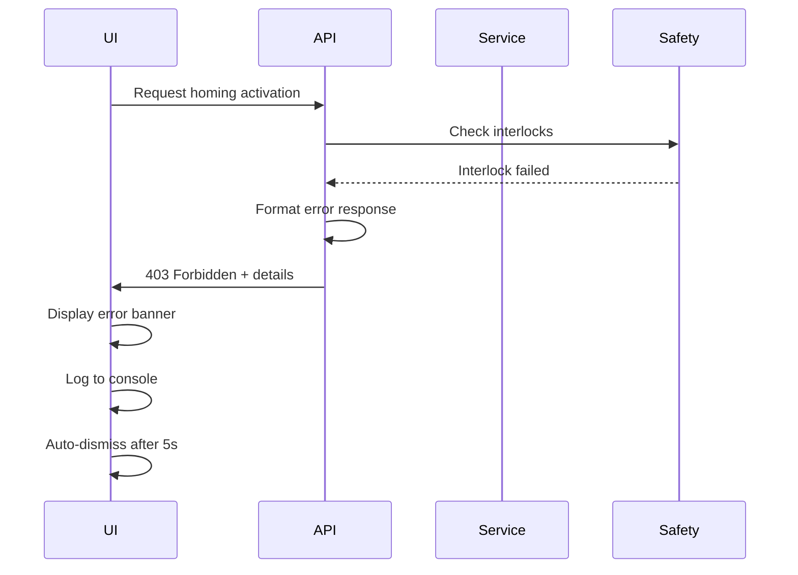

# Error Handling Strategy

## Error Flow



## Error Response Format

```typescript
interface ApiError {
  error: {
    code: string;
    message: string;
    details?: Record<string, any>;
    timestamp: string;
    requestId: string;
  };
}
```

## Frontend Error Handling

```typescript
// hooks/useApiError.ts
export const useApiError = () => {
  const { dispatch } = useContext(AppContext);

  const handleError = (error: AxiosError<ApiError>) => {
    const message =
      error.response?.data?.error?.message || "An unexpected error occurred";

    dispatch({
      type: "ADD_ALERT",
      payload: {
        severity: "error",
        message,
        autoHide: true,
      },
    });

    // Log for debugging
    console.error("[API Error]", error.response?.data);
  };

  return { handleError };
};
```

## Backend Error Handling

```python

```
