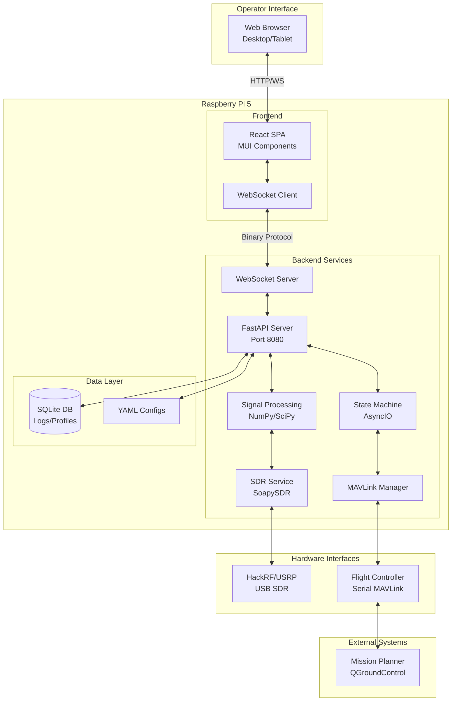

# High Level Architecture

## Technical Summary
The RF-Homing SAR Drone system implements a modular monolith architecture deployed on Raspberry Pi 5, combining a Python AsyncIO backend for real-time SDR signal processing and MAVLink communication with a React/TypeScript frontend for operator control. The backend runs as a systemd service providing continuous RF sensing and safety-critical flight control interfaces, while the frontend delivers real-time signal visualization and homing activation controls via WebSocket. All components run locally on the Pi 5 without external dependencies, ensuring operation in disconnected field environments while achieving the PRD goal of 70% search time reduction through autonomous RF beacon detection and gradient-based homing.

## Platform and Infrastructure Choice
**Platform:** Self-hosted Raspberry Pi 5 (Edge Computing)
**Key Services:** Local Python services (FastAPI, AsyncIO, SoapySDR), Local web server, SQLite for persistence
**Deployment Host and Regions:** Single Raspberry Pi 5 unit mounted on drone, no cloud regions

## Repository Structure
**Structure:** Monorepo
**Monorepo Tool:** Python workspace with shared packages
**Package Organization:** Unified Python backend with embedded static frontend, shared TypeScript types

## High Level Architecture Diagram

## Architectural Patterns
- **Modular Monolith:** Single Python process with distinct service modules - _Rationale:_ Ensures deterministic timing for safety-critical operations
- **Event-Driven AsyncIO:** Non-blocking async operations throughout - _Rationale:_ Handles concurrent SDR sampling, MAVLink communication, and UI updates
- **WebSocket Real-time Updates:** Binary protocol for RSSI streaming - _Rationale:_ Achieves 10Hz update rate with minimal overhead
- **Repository Pattern:** Abstract data access for configs and logs - _Rationale:_ Enables testing and future migration flexibility
- **State Machine Pattern:** Explicit state transitions with safety checks - _Rationale:_ Prevents invalid states in safety-critical operations
- **Component-Based UI:** Reusable React components with TypeScript - _Rationale:_ Type safety and maintainability
- **Operator-Activated Control:** Explicit activation required for autonomous behaviors - _Rationale:_ Safety-first design preventing unexpected automation
