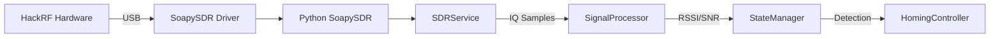

# SDR Integration Architecture

## Overview

The SDR (Software Defined Radio) subsystem provides the hardware interface for RF signal acquisition and processing. The system uses SoapySDR as the hardware abstraction layer, enabling support for multiple SDR devices through a unified API.

## Hardware Support

### Primary: HackRF One
- **Frequency Range**: 1 MHz - 6 GHz
- **Sample Rate**: Up to 20 Msps
- **ADC Resolution**: 8-bit
- **Interface**: USB 2.0
- **Driver**: `hackrf` via SoapySDR
- **Serial**: 66a062dc2227359f (current device)

### Alternative SDR Support
Through SoapySDR abstraction layer:
- **RTL-SDR**: Budget option, 24-1766 MHz
- **USRP B200/B210**: Professional grade, 70 MHz - 6 GHz
- **LimeSDR**: Full duplex, 100 kHz - 3.8 GHz
- **PlutoSDR**: Portable, 325 MHz - 3.8 GHz

## Software Architecture

### SoapySDR Integration

```python
# Hardware abstraction through SoapySDR
import SoapySDR

class SDRService:
    def __init__(self):
        # Enumerate available devices
        devices = SoapySDR.Device.enumerate()
        
        # Select HackRF by default, fallback to first available
        args = dict(driver="hackrf")
        self.device = SoapySDR.Device(args)
```

### Service Layer (`src/backend/services/sdr_service.py`)

The SDR service provides:
- Device enumeration and selection
- Configuration management (frequency, sample rate, gain)
- Async IQ sample streaming
- Health monitoring and status reporting
- Automatic reconnection on device disconnect

### Key Components

#### 1. Device Manager
- Handles device discovery and initialization
- Manages device-specific quirks and capabilities
- Provides fallback logic for multiple SDR types

#### 2. Stream Manager
- Implements async streaming with buffering
- Handles sample format conversion (CF32)
- Monitors for buffer overflows/underflows
- Provides flow control and backpressure handling

#### 3. Configuration Manager
- Validates requested settings against hardware capabilities
- Applies optimal settings per device type
- Manages gain control (AUTO/manual modes)
- Handles frequency correction/calibration

## Installation Requirements

### System Packages (Debian/Ubuntu)

```bash
# Core SoapySDR
sudo apt-get install -y \
    soapysdr-tools \
    libsoapysdr-dev \
    python3-soapysdr

# HackRF support
sudo apt-get install -y \
    hackrf \
    libhackrf-dev \
    soapysdr-module-hackrf

# Optional: RTL-SDR support
sudo apt-get install -y \
    rtl-sdr \
    librtlsdr-dev \
    soapysdr-module-rtlsdr
```

### Python Environment Setup

Since SoapySDR Python bindings are system packages, special setup is required for virtual environments:

#### Option 1: System Site Packages
```bash
# Create venv with system packages access
uv venv --system-site-packages --python=3.11
```

#### Option 2: Symlink Method
```bash
# Create symlinks to system SoapySDR
ln -sf /usr/lib/python3/dist-packages/SoapySDR.py .venv/lib/python*/site-packages/
ln -sf /usr/lib/python3/dist-packages/_SoapySDR.*.so .venv/lib/python*/site-packages/
```

## Signal Flow



## Performance Considerations

### Buffer Management
- Default buffer size: 1024 samples
- Adjustable based on latency requirements
- Multiple buffers for smooth streaming

### Sample Rates
- Default: 2.048 Msps for 406 MHz beacon detection
- Configurable: 0.25 - 20 Msps (HackRF limits)
- Trade-off: Higher rates = better resolution but more CPU

### Gain Settings
- Auto gain for dynamic environments
- Manual gain for controlled conditions
- Device-specific optimal ranges documented

## Error Handling

### Device Disconnection
- Automatic detection via health monitoring
- Exponential backoff reconnection (1s, 2s, 4s... max 30s)
- State preservation during reconnection
- User notification via UI

### Buffer Overflows
- Monitored and logged
- Automatic sample rate adjustment if persistent
- Metrics exposed for performance tuning

### Invalid Configuration
- Validation against device capabilities
- Graceful fallback to defaults
- Clear error messages in logs

## Testing Strategy

### Unit Tests
- Mock SoapySDR for isolated testing
- Verify configuration validation
- Test error handling paths
- Async streaming behavior

### Integration Tests
- Real hardware detection
- Streaming performance validation
- Reconnection scenarios
- Multi-device switching

### Hardware-in-Loop Tests
- Signal generator validation
- Sensitivity measurements
- Frequency accuracy tests
- Long-duration stability

## Configuration

### Default Settings (`config/default.yaml`)
```yaml
sdr:
  driver: "hackrf"  # or "rtlsdr", "uhd", etc.
  frequency: 406.025e6  # 406 MHz beacon
  sample_rate: 2.048e6  # 2.048 Msps
  gain: "auto"  # or 0-47 for HackRF
  bandwidth: 2.0e6  # 2 MHz
  antenna: "RX"
  corrections:
    frequency: 0  # PPM correction
    dc_offset: true
    iq_balance: true
```

### Device Profiles
Pre-configured profiles for common scenarios:
- **beacon_406**: 406 MHz emergency beacon
- **wifi_2.4**: 2.4 GHz WiFi beacon
- **lora_915**: 915 MHz LoRa tracker
- **custom**: User-defined settings

## Monitoring and Diagnostics

### Health Metrics
- Device connection status
- Stream health (samples/sec, drops)
- Buffer utilization
- CPU usage for SDR thread
- Temperature (if available)

### Debug Tools
- `scripts/test_sdr.py`: Manual SDR testing
- `SoapySDRUtil`: Device enumeration and testing
- Signal generator mode for calibration
- IQ recording for offline analysis

## Security Considerations

### USB Permissions
- udev rules for non-root access
- Group membership (plugdev)
- Device-specific permissions

### Resource Limits
- CPU throttling for SDR processing
- Memory limits for sample buffers
- Disk quotas for IQ recordings

## Future Enhancements

### Planned Features
- [ ] Multiple SDR support (diversity reception)
- [ ] Frequency hopping for wideband search
- [ ] IQ recording and playback
- [ ] Remote SDR support (SoapyRemote)
- [ ] GPU acceleration for FFT processing

### Performance Optimizations
- [ ] Zero-copy buffer transfers
- [ ] SIMD optimizations for signal processing
- [ ] Hardware timestamping for precise timing
- [ ] Direct sampling for specific frequencies