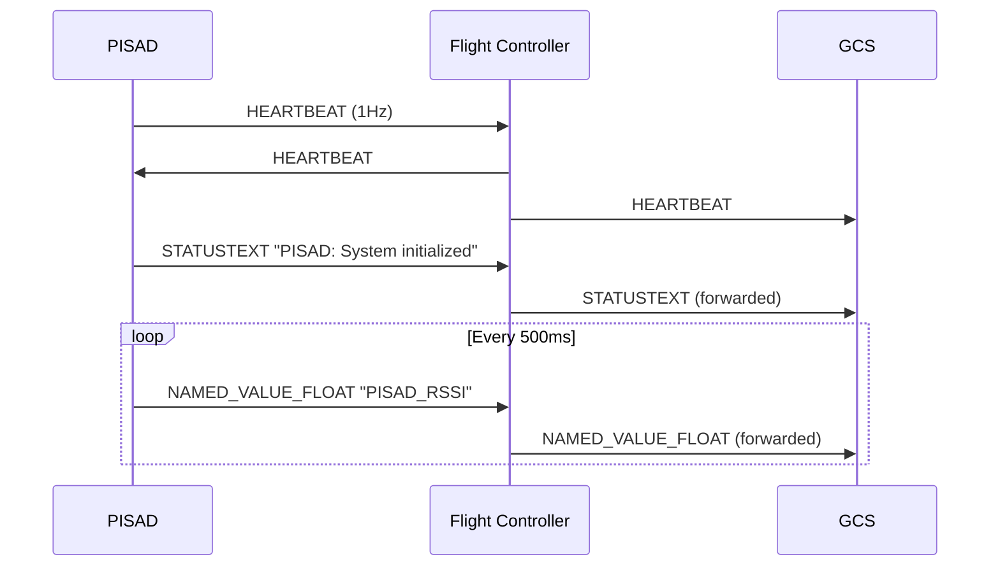
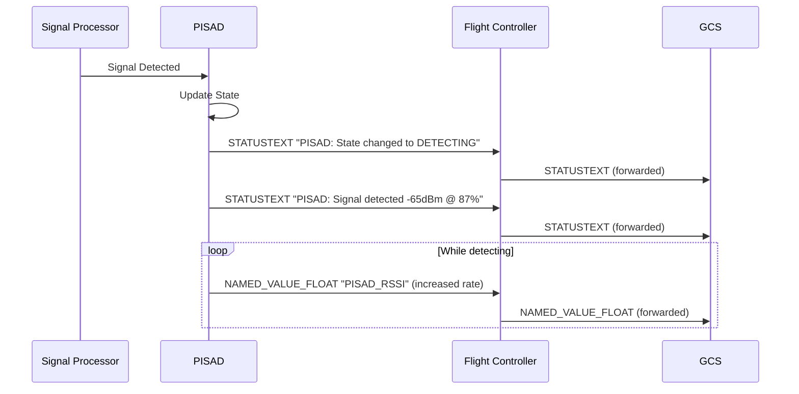

# MAVLink Integration Documentation

## Overview

PISAD integrates with flight controllers via MAVLink 2.0 protocol to provide real-time telemetry streaming to Ground Control Stations (GCS). This integration enables mission commanders to monitor payload status without switching interfaces.

## Connection Configuration

### Serial Connection (Hardware)

- **Port**: `/dev/ttyACM0` or `/dev/ttyAMA0` (Raspberry Pi)
- **Baud Rate**: 115200
- **Protocol**: MAVLink 2.0

### TCP Connection (SITL)

- **Connection String**: `tcp:127.0.0.1:5760`
- **Used for**: Software-in-the-Loop testing

## Telemetry Messages

### NAMED_VALUE_FLOAT - RSSI Streaming

Continuous RSSI values are streamed using NAMED_VALUE_FLOAT messages at 2Hz.

**Message Format:**

```
Name: "PISAD_RSSI"
Value: RSSI in dBm (e.g., -75.0)
Timestamp: Time boot milliseconds
```

**Example Usage:**

```python
# Send RSSI value
mavlink.send_named_value_float("PISAD_RSSI", rssi_dbm)
```

**GCS Display:**

- QGroundControl: Shows in MAVLink Inspector under NAMED_VALUE_FLOAT
- Mission Planner: Available in Quick tab for custom display

### STATUSTEXT - Event Notifications

State changes and detection events use STATUSTEXT messages with appropriate severity levels.

**Message Format:**

```
Severity Levels:
- 0: EMERGENCY
- 1: ALERT
- 2: CRITICAL
- 3: ERROR
- 4: WARNING
- 5: NOTICE (detection events)
- 6: INFO (state changes, health)
- 7: DEBUG
```

**Message Conventions:**
All PISAD messages use "PISAD: " prefix for easy identification.

**State Change Messages:**

```
"PISAD: State changed to IDLE"
"PISAD: State changed to SEARCHING"
"PISAD: State changed to DETECTING"
"PISAD: State changed to HOMING"
"PISAD: State changed to HOLDING"
```

**Detection Event Messages:**

```
"PISAD: Signal detected -65.0dBm @ 87%"
```

**Health Status Messages:**

```
"PISAD: Health {"cpu":45.5,"mem":60.0,"sdr":"OK","temp":65.0}"
```

## Telemetry Rate Configuration

Telemetry rates are configurable to prevent bandwidth saturation:

```yaml
# Configuration (config/default.yaml)
TELEMETRY_RSSI_RATE_HZ: 2.0 # RSSI update rate (0.1-10 Hz)
TELEMETRY_HEALTH_INTERVAL_SECONDS: 10 # Health status interval (1-60 seconds)
TELEMETRY_DETECTION_THROTTLE_MS: 500 # Detection event throttle (100-5000 ms)
TELEMETRY_MAX_BANDWIDTH_KBPS: 10.0 # Maximum bandwidth allocation
```

## API Endpoints

### GET /api/telemetry/config

Retrieve current telemetry configuration.

**Response:**

```json
{
  "rssi_rate_hz": 2.0,
  "health_interval_seconds": 10,
  "detection_throttle_ms": 500,
  "statustext_severity": "INFO",
  "max_bandwidth_kbps": 10.0
}
```

### PUT /api/telemetry/config

Update telemetry rates dynamically.

**Request:**

```json
{
  "rssi_rate_hz": 1.0,
  "health_interval_seconds": 20
}
```

### GET /api/telemetry/status

Get current telemetry status and statistics.

**Response:**

```json
{
  "connected": true,
  "current_rssi": -75.0,
  "messages_sent": 1234,
  "bandwidth_usage_kbps": 0.48,
  "config": {...}
}
```

## GCS Plugin Development

### Custom Message Definitions (Future)

For enhanced GCS integration, custom MAVLink messages are planned:

```xml
<!-- pisad.xml -->
<message id="12000" name="PISAD_SIGNAL_DETECTION">
  <description>Signal detection event from PISAD payload</description>
  <field type="uint64_t" name="timestamp_us">Timestamp (microseconds)</field>
  <field type="float" name="frequency_hz">Detected frequency in Hz</field>
  <field type="float" name="rssi_dbm">Signal strength in dBm</field>
  <field type="float" name="confidence">Detection confidence (0-100%)</field>
  <field type="int32_t" name="lat">Latitude (degrees * 1E7)</field>
  <field type="int32_t" name="lon">Longitude (degrees * 1E7)</field>
</message>

<message id="12001" name="PISAD_HOMING_STATUS">
  <description>Homing status from PISAD payload</description>
  <field type="uint8_t" name="state">Current state (0=IDLE, 1=SEARCHING, etc)</field>
  <field type="float" name="bearing_deg">Bearing to signal (degrees)</field>
  <field type="float" name="distance_m">Estimated distance (meters)</field>
  <field type="float" name="velocity_cmd_x">Commanded velocity X (m/s)</field>
  <field type="float" name="velocity_cmd_y">Commanded velocity Y (m/s)</field>
</message>
```

### GCS Plugin Pseudocode

Example QGroundControl plugin for PISAD telemetry display:

```javascript
// QGroundControl Plugin Example
class PISADPlugin {
  constructor() {
    this.rssiHistory = [];
    this.detections = [];
  }

  onNamedValueFloat(msg) {
    if (msg.name === "PISAD_RSSI") {
      this.updateRSSIDisplay(msg.value);
      this.rssiHistory.push({
        time: msg.time_boot_ms,
        value: msg.value,
      });
    }
  }

  onStatusText(msg) {
    if (msg.text.startsWith("PISAD: ")) {
      const content = msg.text.substring(7);

      if (content.startsWith("State changed to")) {
        this.updateStateDisplay(content.split(" ")[3]);
      } else if (content.includes("Signal detected")) {
        this.addDetectionMarker(content);
      } else if (content.startsWith("Health")) {
        this.updateHealthDisplay(JSON.parse(content.substring(7)));
      }
    }
  }

  updateRSSIDisplay(rssi) {
    // Update RSSI gauge
    document.getElementById("pisad-rssi").value = rssi;

    // Update signal strength indicator
    if (rssi > -60) {
      this.setSignalStrength("strong");
    } else if (rssi > -80) {
      this.setSignalStrength("medium");
    } else {
      this.setSignalStrength("weak");
    }
  }
}
```

## Message Sequence Diagrams

### Initialization Sequence



### Detection Event Sequence



## Bandwidth Considerations

### Message Sizes

- NAMED_VALUE_FLOAT: ~20 bytes
- STATUSTEXT: ~60 bytes
- HEARTBEAT: ~9 bytes

### Bandwidth Calculation

```
RSSI at 2Hz: 20 bytes × 2 Hz × 8 bits = 320 bps
Health at 0.1Hz: 60 bytes × 0.1 Hz × 8 bits = 48 bps
Detection events (avg): 60 bytes × 0.2 Hz × 8 bits = 96 bps
Total: ~464 bps (0.46 kbps)
```

## GCS Compatibility

### QGroundControl

- ✅ NAMED_VALUE_FLOAT displayed in MAVLink Inspector
- ✅ STATUSTEXT shown in message panel
- ✅ Custom values can be added to instrument panel
- ⚠️ JSON in STATUSTEXT may be truncated (50 char limit)

### Mission Planner

- ✅ NAMED_VALUE_FLOAT available in Quick tab
- ✅ STATUSTEXT displayed in messages window
- ✅ Can create custom HUD elements for PISAD data
- ⚠️ May require parameter refresh for new values

## Testing Utilities

### Manual Testing

```bash
# Test RSSI telemetry
curl -X POST http://localhost:8080/api/telemetry/test/rssi \
  -H "Content-Type: application/json" \
  -d '{"rssi": -75.0}'

# Test status message
curl -X POST http://localhost:8080/api/telemetry/test/status \
  -H "Content-Type: application/json" \
  -d '{"message": "Test detection", "severity": 5}'
```

### SITL Testing

```python
# scripts/test_gcs_telemetry.py
import asyncio
from src.backend.services.mavlink_service import MAVLinkService

async def test_telemetry():
    # Connect to SITL
    mavlink = MAVLinkService(device_path="tcp:127.0.0.1:5760")
    await mavlink.start()

    # Wait for connection
    while not mavlink.is_connected():
        await asyncio.sleep(1)

    # Test RSSI streaming
    for i in range(10):
        rssi = -70 - i
        mavlink.update_rssi_value(rssi)
        await asyncio.sleep(0.5)

    # Test state changes
    states = ["IDLE", "SEARCHING", "DETECTING", "HOMING", "HOLDING"]
    for state in states:
        mavlink.send_state_change(state)
        await asyncio.sleep(2)

    # Test detection event
    mavlink.send_detection_event(-65.0, 87.5)

    await mavlink.stop()

if __name__ == "__main__":
    asyncio.run(test_telemetry())
```

## Troubleshooting

### Common Issues

1. **No telemetry received in GCS**
   - Check MAVLink connection status
   - Verify serial port permissions
   - Ensure baud rate matches flight controller settings

2. **STATUSTEXT messages truncated**
   - MAVLink limits STATUSTEXT to 50 characters
   - JSON health status may be cut off
   - Consider using multiple messages or custom message types

3. **High bandwidth usage**
   - Reduce RSSI rate via API
   - Increase health interval
   - Adjust detection throttle

4. **GCS not displaying NAMED_VALUE_FLOAT**
   - Refresh parameters in GCS
   - Check MAVLink Inspector (QGC) or Messages tab (MP)
   - May need to restart GCS to recognize new values

## Future Enhancements

1. **Custom MAVLink Messages**
   - Implement PISAD-specific message definitions
   - Remove 50-character STATUSTEXT limitation
   - Add structured data for complex telemetry

2. **Bidirectional Control**
   - Accept homing enable/disable commands from GCS
   - Implement parameter protocol for configuration
   - Add mission item support for search patterns

3. **Enhanced GCS Plugins**
   - Dedicated PISAD panel in QGroundControl
   - Mission Planner plugin with signal heatmap
   - Real-time spectrum display

4. **Telemetry Recording**
   - MAVLink message logging to SD card
   - Replay capability for post-mission analysis
   - Integration with flight logs
