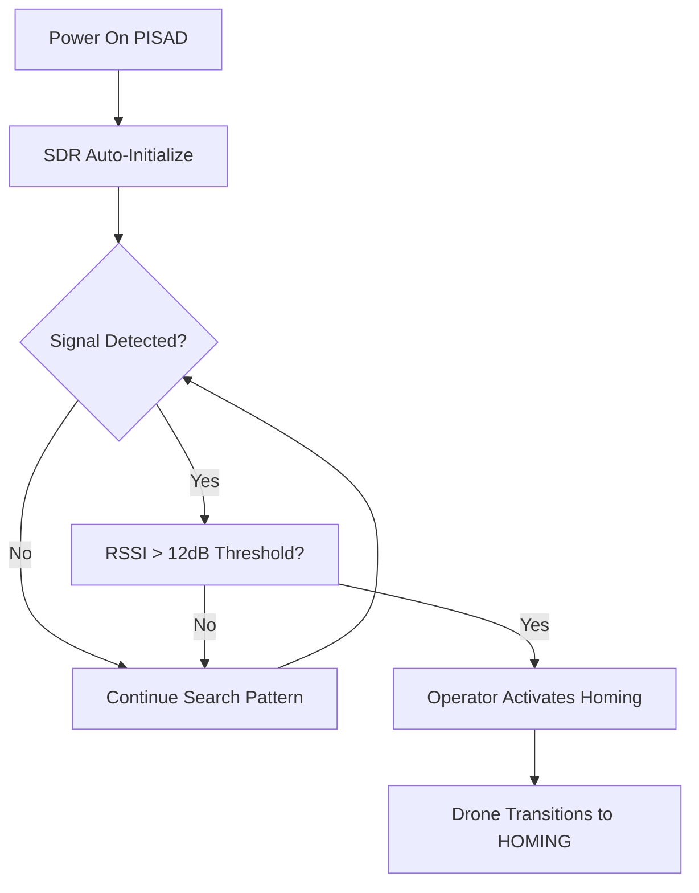
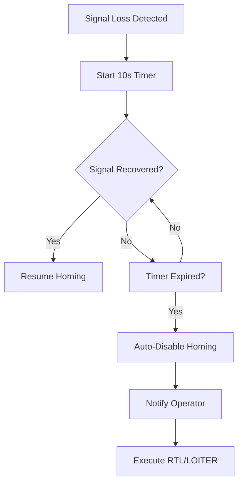
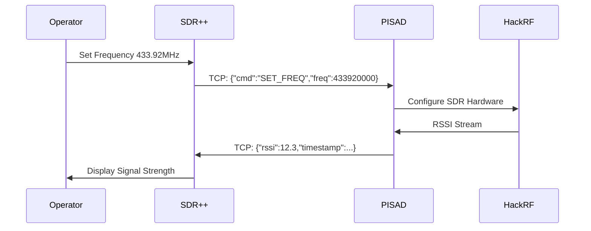

# Story 5.8: Production Deployment and Documentation

## **📋 ACTIVE TODO TASKS**

**`[ ]`** **`[TASK-5.8.1-DEPLOYMENT-PACKAGES]`** **Complete Deployment Package Creation** **[Priority: P1]** **[Concurrency: 🟢 PARALLELIZABLE]**
- **Hardware:** *None required for packaging*
- **Files:** Installation scripts, deployment packages, configuration templates
- **Dependencies:** Stories 5.1-5.7 complete, all Epic 5 components tested and validated
- **Integration Points:** **🔄 PENDING** All Epic 5 components integrated and tested
- **Subtasks:**
  - **[ ]** **SUBTASK-5.8.1.1:** Create automated installation scripts for ground station SDR++ setup
    - **[ ]** **[1a]** Create SDR++ desktop application installation script for Ubuntu/Debian systems
    - **[ ]** **[1b]** Develop PISAD plugin compilation and installation automation
    - **[ ]** **[1c]** Add system dependencies installation (CMake, build tools, SDR libraries)
    - **[ ]** **[1d]** Create plugin registration and configuration automation
    - **[ ]** **[1e]** Add SDR hardware detection and driver installation
    - **[ ]** **[1f]** Implement installation validation with connectivity testing
  - **[ ]** **SUBTASK-5.8.1.2:** Package drone PISAD system with Epic 5 enhancements
    - **[ ]** **[2a]** Create PISAD system update package with TCP bridge service
    - **[ ]** **[2b]** Package dual SDR coordination service and configuration
    - **[ ]** **[2c]** Add enhanced UI components for SDR++ coordination display
    - **[ ]** **[2d]** Create safety system integration package with enhanced fallback
    - **[ ]** **[2e]** Package configuration migration scripts for Epic 5 settings
    - **[ ]** **[2f]** Add rollback capability for failed Epic 5 updates
  - **[ ]** **SUBTASK-5.8.1.3:** Create network configuration automation for TCP communication
    - **[ ]** **[3a]** Develop TCP port configuration and firewall rule automation
    - **[ ]** **[3b]** Create network interface optimization for low-latency communication
    - **[ ]** **[3c]** Add Quality of Service (QoS) configuration for critical RSSI data
    - **[ ]** **[3d]** Implement network security hardening with encrypted channels
    - **[ ]** **[3e]** Create network performance monitoring and alerting setup
    - **[ ]** **[3f]** Add network troubleshooting diagnostic tools and procedures
  - **[ ]** **SUBTASK-5.8.1.4:** Develop deployment validation scripts and health checks
    - **[ ]** **[4a]** Create end-to-end communication validation between ground and drone
    - **[ ]** **[4b]** Develop dual-SDR coordination functionality testing suite
    - **[ ]** **[4c]** Add safety system integration validation with Epic 5 enhancements
    - **[ ]** **[4d]** Create performance benchmark validation for <100ms latency requirements
    - **[ ]** **[4e]** Implement continuous health monitoring with automated alerting
    - **[ ]** **[4f]** Add diagnostic reporting for troubleshooting deployment issues
  - **[ ]** **SUBTASK-5.8.1.5:** Package complete system documentation and operator guides
    - **[ ]** **[5a]** Package installation documentation with step-by-step procedures
    - **[ ]** **[5b]** Create deployment troubleshooting guides with common issue resolution
    - **[ ]** **[5c]** Add system architecture documentation for Epic 5 dual-SDR integration
    - **[ ]** **[5d]** Package network configuration guides with security best practices
    - **[ ]** **[5e]** Create maintenance procedures documentation for ongoing operations
    - **[ ]** **[5f]** Add operator quick reference guides for emergency procedures
- **Context:** Production-ready deployment packages for operational use
- **PRD Reference:** **PRD-AC5.8.1** - Complete installation documentation for ground station SDR++ setup

**`[ ]`** **`[TASK-5.8.2-OPERATOR-DOCUMENTATION]`** **RF Homing Operator Documentation with Visual Guides** **[Priority: P1]** **[Concurrency: 🟢 PARALLELIZABLE]**
- **Hardware:** *RF beacon testing equipment, dual-SDR setup validation*
- **Files:** RF homing operator guides, visual workflows, troubleshooting flowcharts, wireframes
- **Dependencies:** Field testing results from Story 5.7, dual-SDR coordination validation from Story 5.3
- **Integration Points:** **🔄 PENDING** SDR++ plugin operational procedures, PISAD safety system workflows
- **Subtasks:**
  - **[ ]** **SUBTASK-5.8.2.1:** Create RF signal detection operation guide with Mermaid workflow diagrams
    - **[ ]** **[2a]** Document SDR initialization and beacon detection workflow per PRD FR1, FR13
    - **[ ]** **[2b]** Create signal threshold configuration guide (12dB trigger, 6dB drop per PRD FR7)
    - **[ ]** **[2c]** Add frequency selection procedures (433.92MHz default, 850MHz-6.5GHz range per PRD FR1)
    - **[ ]** **[2d]** Document RSSI monitoring and noise floor estimation procedures
    - **[ ]** **[2e]** Create Mermaid flowchart for beacon detection state transitions
    - **[ ]** **[2f]** Add troubleshooting guide for signal detection issues
  - **[ ]** **SUBTASK-5.8.2.2:** Document dual-SDR coordination procedures with system architecture diagrams
    - **[ ]** **[3a]** Create system architecture diagram showing ground SDR++ to drone PISAD communication
    - **[ ]** **[3b]** Document TCP communication setup and network configuration
    - **[ ]** **[3c]** Add ground station SDR++ plugin installation and configuration procedures
    - **[ ]** **[3d]** Create coordination workflow showing automatic frequency synchronization
    - **[ ]** **[3e]** Document priority management and conflict resolution procedures
    - **[ ]** **[3f]** Add performance monitoring procedures for dual-SDR operation
  - **[ ]** **SUBTASK-5.8.2.3:** Develop homing mode activation/deactivation procedures with UI wireframes
    - **[ ]** **[4a]** Create wireframes for homing activation controls per PRD FR14 (explicit operator activation)
    - **[ ]** **[4b]** Document 2-second confirmation requirement for homing mode activation
    - **[ ]** **[4c]** Create emergency "Disable Homing" control documentation per PRD FR16 (<500ms response)
    - **[ ]** **[4d]** Add homing state visualization procedures (gray=disabled, green=enabled, red=active)
    - **[ ]** **[4e]** Document flight mode integration requirements per PRD FR15 (GUIDED mode requirement)
    - **[ ]** **[4f]** Create operator override procedures maintaining GCS authority per PRD FR11
  - **[ ]** **SUBTASK-5.8.2.4:** Create emergency procedures flowcharts for signal loss and safety overrides
    - **[ ]** **[5a]** Create signal loss recovery flowchart per PRD FR17 (10-second auto-disable)
    - **[ ]** **[5b]** Document emergency stop procedures maintaining <500ms response per PRD FR16
    - **[ ]** **[5c]** Add communication loss fallback procedures with RTL/LOITER activation per PRD FR10
    - **[ ]** **[5d]** Create safety system override documentation preserving operator authority
    - **[ ]** **[5e]** Document battery monitoring integration and low-battery RTL procedures
    - **[ ]** **[5f]** Add geofence enforcement and boundary violation response procedures per PRD FR8
- **Context:** Visual operator documentation for RF beacon detection and dual-SDR mission execution per PRD FR11-FR17
- **PRD Reference:** **PRD-FR14, FR16, FR17** - Operator homing controls and safety procedures

## **🚨 CURRENT BLOCKERS**

- **Epic 5 Completion**: All stories 5.1-5.7 must be complete and validated
- **Field Test Results**: Story 5.7 results needed for operational documentation
- **Production Environment**: Final deployment environment specifications needed
- **Certification Requirements**: Final safety and operational certification requirements

## **✅ DEPLOYMENT FOUNDATION**

### **Existing Deployment Infrastructure**
- **Systemd Service Management**: Automatic startup and recovery (Story 1.1)
- **Configuration System**: YAML-based profile management (Story 1.5)
- **Web Interface Deployment**: FastAPI server with static serving (Story 1.4)
- **Safety System Integration**: Comprehensive safety interlock deployment (Story 2.2)

### **Enhanced Deployment with SDR++ Integration**
- **Dual-SDR Coordination**: Ground station and drone system deployment
- **Network Configuration**: TCP communication setup and optimization
- **Security Hardening**: Network security and access control
- **Monitoring Integration**: Performance and health monitoring deployment

## **Epic 5: Migration to SDR++ Integration**
**Story ID:** `5.8`
**Priority:** `P1` - Critical Deployment Story
**Status:** 🔄 **READY FOR EXECUTION**
**Dependencies:** Stories 5.1-5.7 complete and validated

## **Story Overview**
**As a** deployment engineer,
**I want** complete deployment packages and documentation for dual-SDR systems,
**so that** operators can successfully deploy and maintain coordinated SDR++ and PISAD systems.

## **Acceptance Criteria**

### **Core Deployment Requirements**
- **[ ] AC1**: Complete installation documentation for ground station SDR++ setup
- **[ ] AC2**: Network configuration guides for TCP communication between ground and drone
- **[ ] AC3**: RF homing operator documentation with visual workflows and Mermaid diagrams per PRD FR14-FR17
- **[ ] AC4**: Troubleshooting guides for common coordination issues and recovery procedures
- **[ ] AC5**: Maintenance procedures for keeping both systems synchronized and updated
- **[ ] AC6**: Security guidelines for TCP communication and network hardening
- **[ ] AC7**: Performance monitoring and alerting configuration for production deployment
- **[ ] AC8**: Complete system documentation including architecture, interfaces, and protocols

### **Enhanced Deployment Integration**
- **[ ] AC9**: Integration with existing PISAD deployment infrastructure from Stories 1.1, 1.4, 1.5
- **[ ] AC10**: Automated deployment validation and health check procedures
- **[ ] AC11**: Version control and update procedures for dual-SDR coordination
- **[ ] AC12**: Production environment optimization and configuration recommendations

## **Deployment Package Components**

### **Ground Station Deployment Package**
```
Ground Station Package:
├── sdrpp_installation/
│   ├── install_sdrpp.sh          # Automated SDR++ installation
│   ├── pisad_plugin/              # PISAD plugin binaries and config
│   ├── dependencies.sh           # System dependencies installation
│   └── configuration_templates/   # Network and plugin configuration
├── documentation/
│   ├── installation_guide.md     # Step-by-step setup instructions
│   ├── network_configuration.md  # TCP communication setup
│   ├── troubleshooting.md        # Common issues and solutions
│   └── operator_manual.md        # Complete operator documentation
└── validation/
    ├── health_check.sh           # Installation validation
    ├── connectivity_test.sh      # Network communication testing
    └── performance_benchmark.sh  # Performance validation
```

### **Drone System Enhancement Package**
```
Drone Enhancement Package:
├── pisad_enhancements/
│   ├── tcp_bridge_service/       # TCP communication service
│   ├── dual_coordination/        # SDR coordination service
│   ├── enhanced_ui/              # UI enhancements for coordination
│   └── safety_integration/       # Enhanced safety systems
├── deployment/
│   ├── update_pisad.sh          # Automated system update
│   ├── configuration_migration.sh # Config migration and validation
│   ├── service_installation.sh  # New services installation
│   └── rollback_procedures.sh   # Emergency rollback capability
└── validation/
    ├── system_validation.sh     # Complete system validation
    ├── safety_check.sh          # Safety system validation
    └── performance_test.sh      # Performance regression testing
```

## **Documentation Framework**

### **Installation and Setup Documentation**
- **[ ]** **Ground Station Installation Guide**:
  - **[ ]** SDR++ installation and configuration procedures
  - **[ ]** PISAD plugin installation and setup
  - **[ ]** Network configuration for TCP communication
  - **[ ]** System dependencies and hardware requirements
- **[ ]** **Drone System Enhancement Guide**:
  - **[ ]** PISAD system update procedures
  - **[ ]** New services installation and configuration
  - **[ ]** Configuration migration and validation
  - **[ ]** Safety system integration verification

### **Visual Operational Documentation Framework**

#### **RF Homing Operator Guide with Mermaid Diagrams**
- **[ ]** **Signal Detection Workflow**:


- **[ ]** **Dual-SDR Coordination Architecture**:
```mermaid
graph TB
    subgraph Ground["Ground Station"]
        SDR["SDR++ Desktop"]
        Plugin["PISAD Plugin"]
    end
    
    subgraph Drone["Drone System"]  
        PISAD["PISAD Service"]
        HackRF["HackRF SDR"]
    end
    
    SDR <--> Plugin
    Plugin <-->|TCP 8081| PISAD
    PISAD <--> HackRF
```

- **[ ]** **Homing Mode UI Wireframes**:
```
┌─────────────────────────────────────────┐
│ PISAD RF Homing Control                 │
├─────────────────────────────────────────┤
│ Signal Status: [●] DETECTED  12.3 dB   │
│ Frequency:     [433.920] MHz            │
│ Mode:          [SEARCHING] ▼            │
│                                         │
│ ┌─────────────────────────────────────┐ │
│ │     🔴 ACTIVATE HOMING MODE        │ │
│ │   (Hold 2 seconds to confirm)      │ │
│ └─────────────────────────────────────┘ │
│                                         │
│ Emergency: [⏹ DISABLE HOMING]          │
└─────────────────────────────────────────┘
```

#### **Emergency Procedures Flowchart**
- **[ ]** **Signal Loss Recovery**:


#### **Technical Reference with System Diagrams**
- **[ ]** **Network Communication Protocol**:


### **Maintenance and Support Documentation**
- **[ ]** **System Maintenance Guide**:
  - **[ ]** Routine maintenance procedures and schedules
  - **[ ]** Software update and synchronization procedures
  - **[ ]** Hardware maintenance and calibration procedures
  - **[ ]** Backup and recovery procedures
- **[ ]** **Troubleshooting and Support Guide**:
  - **[ ]** Common issues identification and resolution
  - **[ ]** Diagnostic procedures and tools
  - **[ ]** Performance optimization recommendations
  - **[ ]** Support escalation procedures and contacts

## **Security and Network Configuration**

### **Network Security Implementation**
- **[ ]** **TCP Communication Security**:
  - **[ ]** Encrypted communication channel implementation
  - **[ ]** Authentication and authorization protocols
  - **[ ]** Network access control and firewall configuration
  - **[ ]** Security monitoring and intrusion detection
- **[ ]** **System Hardening Procedures**:
  - **[ ]** Operating system security configuration
  - **[ ]** Service isolation and privilege limitation
  - **[ ]** Log security and audit trail protection
  - **[ ]** Regular security update procedures

### **Network Configuration Automation**
- **[ ]** **Automated Network Setup**:
  - **[ ]** TCP port configuration and firewall rules
  - **[ ]** Network interface optimization for performance
  - **[ ]** Quality of Service (QoS) configuration for critical traffic
  - **[ ]** Network monitoring and performance alerting
- **[ ]** **Network Validation Tools**:
  - **[ ]** Connectivity testing and validation scripts
  - **[ ]** Performance benchmarking and optimization tools
  - **[ ]** Network troubleshooting diagnostic utilities
  - **[ ]** Communication health monitoring tools

## **Production Monitoring and Alerting**

### **System Monitoring Integration**
- **[ ]** **Performance Monitoring Setup**:
  - **[ ]** Real-time performance metrics collection and display
  - **[ ]** Resource utilization monitoring and alerting
  - **[ ]** Communication performance and health monitoring
  - **[ ]** Safety system status monitoring and validation
- **[ ]** **Alerting and Notification System**:
  - **[ ]** Critical system alerts and notification procedures
  - **[ ]** Performance degradation detection and alerting
  - **[ ]** Communication failure detection and response
  - **[ ]** Safety system status alerts and escalation

### **Health Check and Validation**
- **[ ]** **Automated Health Checks**:
  - **[ ]** System component status validation
  - **[ ]** Communication connectivity and performance testing
  - **[ ]** Safety system operational verification
  - **[ ]** Performance benchmark validation
- **[ ]** **Continuous Validation Procedures**:
  - **[ ]** Periodic system health assessment
  - **[ ]** Performance trend analysis and optimization
  - **[ ]** Configuration validation and compliance checking
  - **[ ]** Security audit and vulnerability assessment

## **Quality Assurance**

### **Deployment Testing Validation**
- **[ ]** All deployment packages tested in clean environment
- **[ ]** Installation procedures validated with step-by-step execution
- **[ ]** Configuration automation tested across different environments
- **[ ]** Documentation accuracy verified through independent testing

### **Production Environment Validation**
- **[ ]** Complete system deployment in production-equivalent environment
- **[ ]** Performance validation under production load conditions
- **[ ]** Security configuration tested and validated
- **[ ]** Maintenance procedures tested and documentation validated

## **Definition of Done**

### **Technical Requirements**
- **[ ]** All 12 acceptance criteria implemented and validated
- **[ ]** Complete deployment packages tested and functional
- **[ ]** Network configuration automation operational
- **[ ]** Security hardening implemented and validated

### **Documentation Requirements**
- **[ ]** Complete installation and setup documentation
- **[ ]** Comprehensive operator training materials
- **[ ]** Technical reference documentation for all components
- **[ ]** Maintenance and troubleshooting guides

### **Deployment Requirements**
- **[ ]** Automated deployment procedures tested and validated
- **[ ]** Production monitoring and alerting operational
- **[ ]** Security configuration implemented and audited
- **[ ]** System validation procedures operational

### **Operational Readiness**
- **[ ]** System ready for production deployment
- **[ ]** Operators trained and certified for dual-SDR operation
- **[ ]** Support procedures and escalation paths established
- **[ ]** Maintenance schedules and procedures operational

## **PRD Requirements Coverage**
- **Complete Deployment:** ✅ **Production-ready packages** - All components packaged and tested
- **Operator Support:** ✅ **Comprehensive documentation** - Training and operational procedures
- **System Maintenance:** ✅ **Ongoing support procedures** - Maintenance and troubleshooting
- **Security Implementation:** ✅ **Network hardening** - Security and access control
