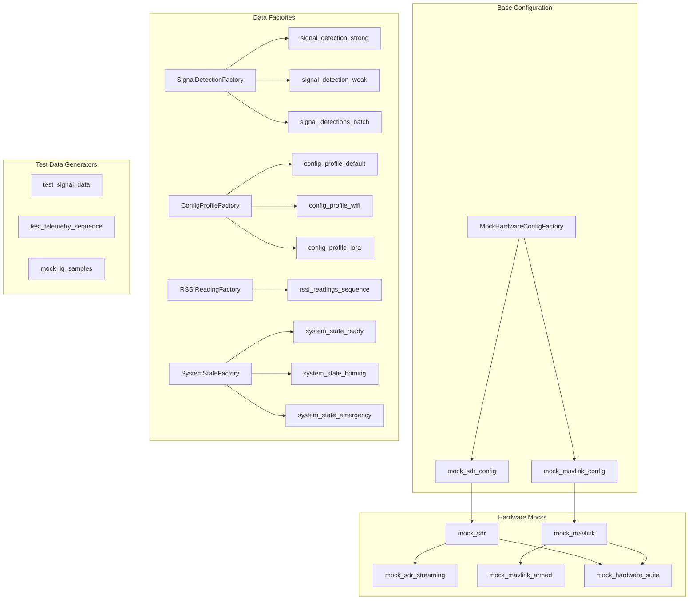

# Test Fixture Dependency Graph

## Overview
This document describes the fixture dependency hierarchy to help developers understand and maintain the test infrastructure.

## Fixture Hierarchy



## Fixture Categories

### 1. Hardware Mock Fixtures
Provide mock hardware interfaces for testing without real hardware.

| Fixture | Purpose | Dependencies | Cleanup |
|---------|---------|--------------|---------|
| `mock_sdr` | Connected SDR mock | `mock_sdr_config` | Auto-disconnect |
| `mock_sdr_streaming` | Streaming SDR mock | `mock_sdr` | Auto-stop streaming |
| `mock_mavlink` | Connected MAVLink mock | `mock_mavlink_config` | Auto-disconnect |
| `mock_mavlink_armed` | Armed vehicle mock | `mock_mavlink` | Auto-disarm |
| `mock_hardware_suite` | Complete hardware set | `mock_sdr`, `mock_mavlink` | Auto-cleanup |

### 2. Data Factory Fixtures
Generate test data with realistic characteristics.

| Fixture | Purpose | Factory Used | Traits Available |
|---------|---------|--------------|------------------|
| `signal_detection_strong` | Strong signal | `SignalDetectionFactory` | `strong_signal` |
| `signal_detection_weak` | Weak signal | `SignalDetectionFactory` | `weak_signal` |
| `signal_detections_batch` | 10 detections | `SignalDetectionFactory` | Mixed |
| `config_profile_default` | Default config | `ConfigProfileFactory` | `default` |
| `config_profile_wifi` | WiFi config | `ConfigProfileFactory` | `wifi_beacon` |
| `config_profile_lora` | LoRa config | `ConfigProfileFactory` | `lora_beacon` |
| `system_state_ready` | Ready state | `SystemStateFactory` | `ready_for_homing` |
| `system_state_homing` | Homing state | `SystemStateFactory` | `homing_active` |
| `system_state_emergency` | Emergency state | `SystemStateFactory` | `emergency` |

### 3. Test Data Generators
Generate synthetic test data.

| Fixture | Purpose | Parameters | Output |
|---------|---------|------------|--------|
| `test_signal_data` | RSSI time series | 60s @ 10Hz | numpy array |
| `test_telemetry_sequence` | Telemetry updates | 60s sequence | list of dicts |
| `mock_iq_samples` | IQ samples | 1024 samples | complex64 array |

## Usage Examples

### Basic Hardware Mock Test
```python
@pytest.mark.unit
async def test_sdr_connection(mock_sdr):
    """Test using connected SDR mock."""
    assert mock_sdr._is_connected
    status = await mock_sdr.get_status()
    assert status["connected"] is True
```

### Using Factory Traits
```python
@pytest.mark.unit
def test_weak_signal_detection(signal_detection_weak):
    """Test with weak signal characteristics."""
    assert signal_detection_weak["rssi"] < -80
    assert signal_detection_weak["snr"] < 10
    assert signal_detection_weak["state"] == "SEARCHING"
```

### Complex Fixture Combination
```python
@pytest.mark.integration
async def test_full_system(
    mock_hardware_suite,
    system_state_ready,
    config_profile_default,
    test_signal_data
):
    """Integration test using multiple fixtures."""
    sdr = mock_hardware_suite["sdr"]
    mavlink = mock_hardware_suite["mavlink"]

    # Test with all components
    assert sdr._is_connected
    assert mavlink._is_connected
    assert system_state_ready["flight_mode"] == "GUIDED"
```

### Creating Custom Factory Configurations
```python
def test_custom_config():
    """Create custom configurations using factories."""
    # Custom SDR config
    faulty_sdr = MockSDRFactory(faulty=True)
    assert faulty_sdr.config.error_rate == 0.5

    # Custom MAVLink state
    low_battery_mavlink = MockMAVLinkFactory(low_battery=True)
    assert low_battery_mavlink.telemetry["battery_percent"] == 15.0
```

## Best Practices

### 1. Fixture Selection
- Use the most specific fixture for your needs
- Prefer factory fixtures over manual object creation
- Use traits for common test scenarios

### 2. Fixture Composition
- Combine fixtures for integration tests
- Keep unit tests using single fixtures
- Use `mock_hardware_suite` for full-stack tests

### 3. Cleanup and Isolation
- All fixtures auto-cleanup after test
- Hardware mocks reset state between tests
- No shared state between test runs

### 4. Performance Considerations
- Lightweight fixtures for unit tests
- Heavier fixtures only for integration tests
- Use `pytest.mark.serial` for tests with shared resources

## Fixture Maintenance

### Adding New Fixtures
1. Add factory to `tests/fixtures/factories.py`
2. Add fixture to `tests/fixtures/conftest.py`
3. Update this documentation
4. Add tests for the fixture itself

### Modifying Existing Fixtures
1. Check all dependent fixtures
2. Run tests to verify no breakage
3. Update documentation if behavior changes

### Removing Fixtures
1. Search codebase for usage
2. Provide migration path if needed
3. Remove from factories and conftest
4. Update documentation

## Troubleshooting

### Common Issues

| Issue | Cause | Solution |
|-------|-------|----------|
| Fixture not found | Not imported in conftest | Add to appropriate conftest.py |
| Async fixture error | Missing async marker | Use `@pytest.fixture` with async function |
| Cleanup not working | Manual cleanup needed | Add finalizer or use context manager |
| Shared state issues | Fixture scope too broad | Use function scope (default) |
| Parallel test failures | Fixture uses shared resource | Mark test with `@pytest.mark.serial` |

### Debug Commands
```bash
# List all available fixtures
uv run pytest --fixtures

# Show fixture usage in tests
rg "@pytest.fixture" tests/

# Find tests using specific fixture
rg "def test.*\(.*mock_sdr.*\)" tests/

# Run tests with fixture setup/teardown output
uv run pytest -s -vv tests/backend/unit/test_example.py
```

## Performance Impact

### Fixture Creation Times
| Fixture Type | Creation Time | Teardown Time |
|--------------|---------------|---------------|
| Config factories | <1ms | <1ms |
| Mock hardware | 5-10ms | 5-10ms |
| Data factories | 1-5ms | <1ms |
| Test data generators | 10-50ms | <1ms |

### Parallel Execution
- All data factory fixtures are parallel-safe
- Mock hardware fixtures are parallel-safe (separate instances)
- File/database fixtures marked as serial
- 8 workers optimal for Pi 5 (8 cores)
